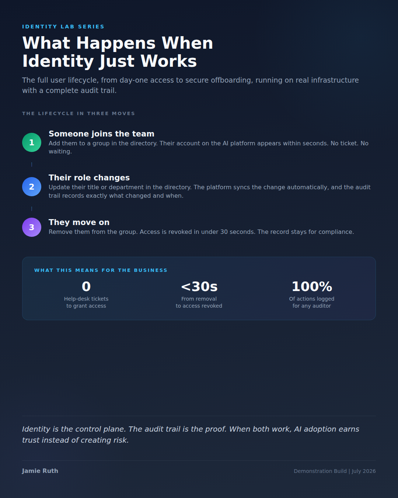
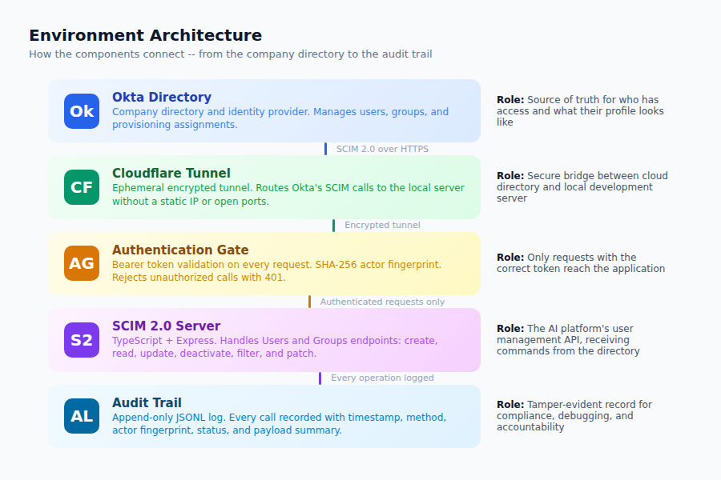
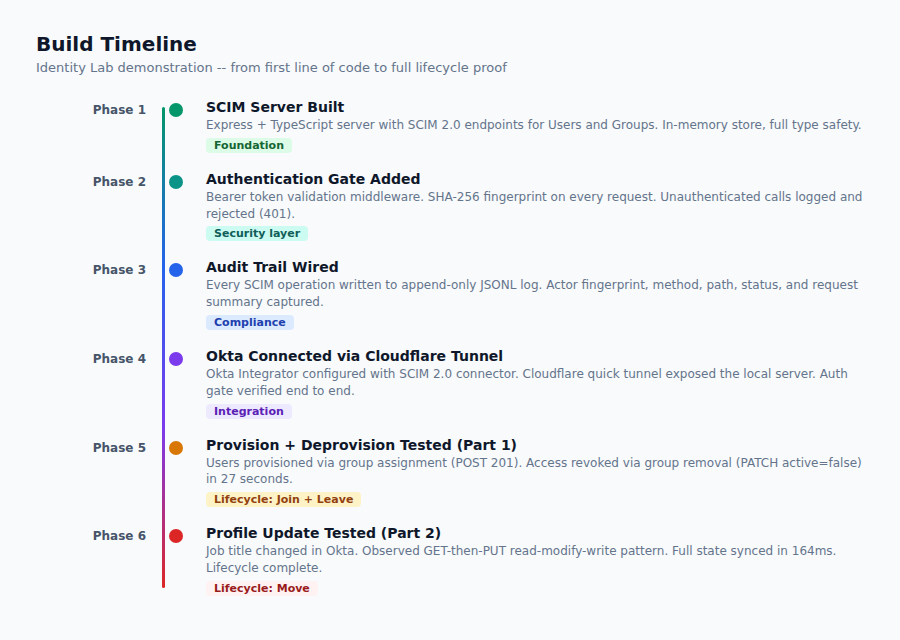

<div align="center">

# Identity Lab: SCIM Lifecycle Server

**A working demonstration of enterprise identity management, built from scratch.**

Provision users. Update profiles. Revoke access. Log everything.

[](https://nodejs.org/)
[](https://www.typescriptlang.org/)
[](https://datatracker.ietf.org/doc/html/rfc7644)
[](https://www.okta.com/)
[](LICENSE)

<br>



</div>

---

## What This Is

This is a real, working server that connects a company directory (Okta) to an application's user management system. It is the same type of infrastructure that large companies use to manage who has access to their tools -- except built from scratch so every layer is visible and documented.

The server speaks **SCIM 2.0**, the industry standard protocol that enterprise directories use to create, update, and deactivate user accounts in connected applications. When someone joins a team in the directory, their account appears automatically. When their role changes, the profile syncs. When they leave, access is revoked in seconds. Every action is logged.

This is a **demonstration build** -- not production software. It was built to prove the concept, document every step, and make the entire lifecycle visible in a way that is hard to do with commercial products.

---

## Why This Matters

Every organization that rolls out a new tool faces the same problem: **who gets access, how fast, and how do you prove it?**

When a company adopts an AI platform (or any enterprise tool), someone has to answer these questions:

- When a new person joins the team, how quickly can they start using the tool?
- When someone changes roles, does their profile update automatically?
- When someone leaves, how fast is their access revoked? Can you prove it?
- If an auditor asks "who had access on this date," can you answer from a record?

This project answers all four. Not with slides -- with working software and an audit trail.

<div align="center">

| What | How | Result |
|------|-----|--------|
| New team member needs access | Add them to a group in the directory | Account created in seconds. No ticket. |
| Someone changes roles | Update their title in the directory | Profile syncs automatically |
| Someone leaves the team | Remove them from the group | Access revoked in under 30 seconds |
| Auditor asks what happened | Check the audit trail | Every action logged with timestamp and actor |

</div>

---

## How It Works

<div align="center">

</div>

<br>

The system has five layers, each doing one job:

**Okta Directory** -- The company directory. This is the source of truth for who works where, what team they are on, and whether they should have access. Okta is the same product that Fortune 500 companies use.

**Cloudflare Tunnel** -- A secure, encrypted bridge between Okta (in the cloud) and the SCIM server (running locally). No open ports, no static IP needed.

**Authentication Gate** -- Every request must include a valid bearer token. Invalid or missing tokens are rejected with a 401 and logged. The token is never stored -- instead, a SHA-256 fingerprint identifies the caller.

**SCIM 2.0 Server** -- The core of this project. A TypeScript + Express application that handles the standard SCIM endpoints: creating users, reading profiles, updating records, and deactivating accounts.

**Audit Trail** -- Every operation writes a structured JSON log line. Timestamp, HTTP method, actor fingerprint, request details, and response status. Append-only, machine-readable, and ready for compliance review.

---

## What Was Proven

<div align="center">

</div>

<br>

The full **joiner-mover-leaver** lifecycle was tested against a live Okta organization:

### 1. Provision (Joiner)
Two test users were assigned to a group in Okta. Within seconds, both accounts appeared on the SCIM server. The audit trail recorded both with the same actor fingerprint.

```
POST /scim/v2/Users -> 201 Created
Actor: cda486dca4a9
```

### 2. Update (Mover)
A job title was changed in Okta. The server received a GET (read the current record) followed by a PUT (write back the full updated profile) -- all within 164 milliseconds. This is Okta's read-modify-write pattern: the server always receives the complete user state, not just the changed field.

```
GET  /scim/v2/Users/8e9b5346-... -> 200  (read current record)
PUT  /scim/v2/Users/8e9b5346-... -> 200  (write updated record)
Elapsed: 164ms | Actor: cda486dca4a9
```

### 3. Deprovision (Leaver)
A user was removed from the group. 27 seconds later, the SCIM server received a PATCH setting `active: false`. The user record was preserved for compliance, but access was revoked.

```
PATCH /scim/v2/Users/f87924e5-... -> 200
Operations: [{op: replace, path: active, value: false}]
Actor: cda486dca4a9
```

**One actor fingerprint across all three operations.** Every call logged. The same Okta integration, the same token, the same server -- proven end to end.

---

## Project Structure

```
lab-okta-scim-server/
  src/
    index.ts          # Server entry point
    app.ts            # Express app setup, SCIM router, audit middleware
    auth.ts           # Bearer token authentication gate
    audit.ts          # SHA-256 fingerprint + append-only JSONL logger
    scim.ts           # SCIM 2.0 protocol helpers (responses, filtering, pagination)
    store.ts          # In-memory user and group storage
    types.ts          # TypeScript interfaces for SCIM resources
    routes/
      users.ts        # /scim/v2/Users -- create, read, update, patch, filter
      groups.ts       # /scim/v2/Groups -- create, read, patch (member add/remove)
  tests/
    scim.test.ts      # Integration tests (provision, filter, deactivate, group ops)
  docs/
    Identity-Lab-02-Full-SCIM-Lifecycle.pdf   # Full technical writeup
    images/                                    # Visualizations and infographic
  .env.example        # Sample environment variables (safe to share)
  package.json        # Dependencies: express, dotenv, uuid
  tsconfig.json       # TypeScript strict mode, ES2022 target
  vitest.config.ts    # Test runner configuration
```

---

## Running It Yourself

### Prerequisites

- [Node.js 22+](https://nodejs.org/)
- [pnpm](https://pnpm.io/) (or npm/yarn)

### Setup

```bash
# Clone the repository
git clone https://github.com/fso-datawarrior/lab-okta-scim-server.git
cd lab-okta-scim-server

# Install dependencies
pnpm install

# Create your environment file
cp .env.example .env
# Edit .env and set SCIM_BEARER_TOKEN to a long random secret
```

### Run the server

```bash
# Development mode (auto-reload on changes)
pnpm dev

# Production mode
pnpm start
```

The server starts on `http://localhost:3000` (or whatever PORT you set in `.env`).

### Run the tests

```bash
pnpm test
```

The test suite covers: authentication rejection, user creation, userName filtering, user deactivation via PATCH, and group member add/remove.

### Expose to Okta (optional)

To connect a live Okta org, expose the server with a Cloudflare tunnel:

```bash
# Install cloudflared: https://developers.cloudflare.com/cloudflare-one/connections/connect-networks/downloads/
cloudflared tunnel --url http://localhost:3000
```

Use the generated URL as the SCIM Base URL in your Okta SCIM integration settings.

---

## Key Technical Details

**SCIM 2.0 Compliance** -- The server implements the core SCIM 2.0 endpoints defined in [RFC 7644](https://datatracker.ietf.org/doc/html/rfc7644): ServiceProviderConfig, Users (CRUD + filter), and Groups (CRUD + member PATCH). Responses use the `application/scim+json` content type.

**Okta's Update Pattern** -- Okta does not send PATCH for profile updates. It performs a GET-then-PUT read-modify-write cycle. This means the server always receives the complete user state on every update, and the audit trail contains full snapshots that can be diffed.

**Actor Fingerprinting** -- The first 12 hex characters of a SHA-256 hash of the bearer token are logged as the actor on every request. This identifies the caller without storing the credential.

**Audit Format** -- Each operation writes one JSON line to `logs/audit.jsonl`:

```json
{
  "timestamp": "2026-07-09T21:08:42.123Z",
  "method": "POST",
  "path": "/scim/v2/Users",
  "actor": "cda486dca4a9",
  "request": { "userName": "grace@example.com", "displayName": "Grace Test" },
  "status": 201
}
```

---

## Documentation

The full technical writeup is available as a PDF in the `docs/` directory:

**[Identity Lab Part 2: The Full SCIM Lifecycle (PDF)](docs/Identity-Lab-02-Full-SCIM-Lifecycle.pdf)**

It covers everything in this README in more depth, including: the executive summary, all three lifecycle operations with audit evidence, the actor fingerprint system, the authentication gate, architecture overview, key findings, and what comes next.

---

## What Comes Next

This build proves the SCIM lifecycle. The next steps extend it:

- **Single sign-on (SSO)** -- OIDC authentication from the same Okta org into a live application
- **MCP server for identity operations** -- An AI assistant that can provision and deprovision users, with human approval on anything destructive and an audit line on every action
- **Cross-directory testing** -- The same lifecycle repeated on Microsoft Entra ID

---

## About

Built by [Jamie Ruth](https://www.linkedin.com/in/jamie-ruth) as part of the Identity Lab series -- a hands-on exploration of enterprise identity management for AI platform adoption.

The goal: AI adoption where trust is built in, not bolted on. The right people productive on day one, access that is provably correct at all times, and answers for any auditor question that come from a record instead of somebody's memory.

---

<div align="center">

*This is a demonstration build. All test users, groups, and credentials are lab-only resources.*

</div>
